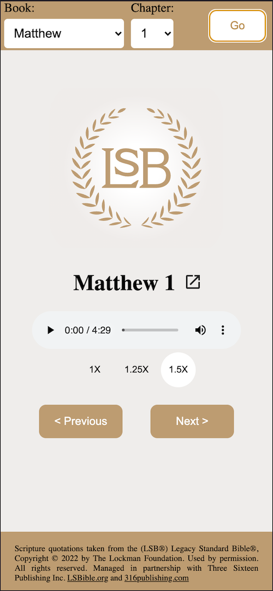

# Legacy Standard Bible - Audio Bible Generator

This python script generates audio bible mp3s one chapter at a time using
the publicly available [Legacy Standard Bible](https://read.lsbible.org) web app. This is not a webscraper
but simply uses the JSON response from [read.lsbible.org](https://read.lsbible.org) formats the text a little
and passes it to the Google Text-To-Speech API in order to get an audio reading of the text. It will also generate
an html file with an `<audio>` element wired up to the mp3 file with the read speed set to
1.5x by default. Once the script has finsihed processing the mp3, it will automaticlly open up
a web browser with the audio player ready to go.

## Set up environment - MacOS
This script is written in python and can be run in any environment with python read,
but for simplicity, here are some instructions on how to run it in a python
virtual environment using the `virtualenv` python package.

```bash
~ brew install pip
~ pip install virtualenv
~ mkdir <dirname>
~ cd <dirname>
~ virtualenv .env
~ source .env/bin/activate
~ git clone https://github.com/lvstross/audioBible.git
~ cd audioBible
~ pip install -r requirements.txt
~ python lsbible.py 1+timothy+1
```

This will generate two files and two folders if they don't already exist:
1. An mp3 file and it's corresponding directory.
2. An HTML file and it's corresponding directory.

## Exit environment

```bash
~ deactivate
```

This python environment was generated using [virtualenv](https://pythonbasics.org/virtualenv/)

